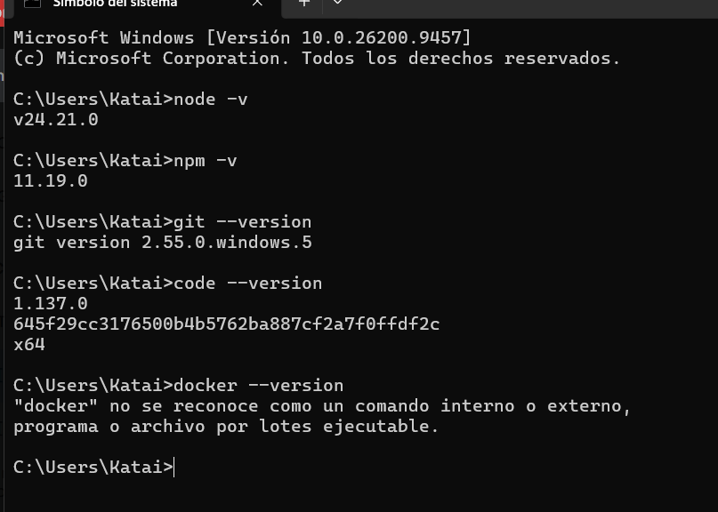
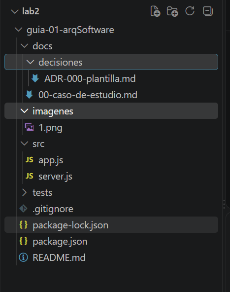

# guia-01-arqSoftware
desarrollo de la guia 01
NOMBRE: Castañeda Mallqui, Klidsman Junior

El curso de Arquitectura de Software enseña a diseñar la estructura de alto nivel de un sistema informático, definiendo sus componentes, relaciones y reglas para garantizar que funcione de manera eficiente

Mis expectativas sobre el curso es dejar de ver el software como simples funciones o clases y empezar a verlo como un conjunto de piezas conectadas

DOCENTE: Ing. LIZBETH JAICO QUISPE

• imágenes del paso 1 y paso 2

